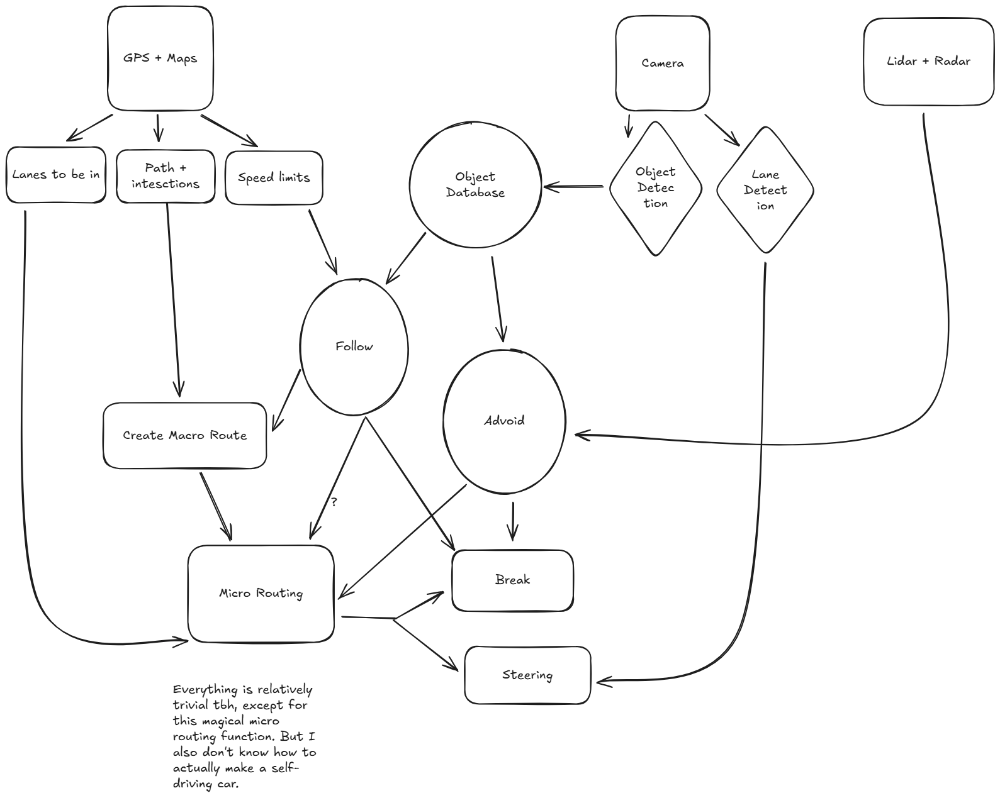

# Task 2

System to drive a car:

To start it off, a car needs to know where it is going. For navigation build a path of all the intersections that you will need to turn at (as well as which lane to be in), and speed (a combination of speed limits and speed for turning). This limit speed will force the car to slow down while turning, and not exceede any speed limits. Then the camera data will need to be analyzed. From the camera data, the car will need to identify other cars and obstacles. Cars should be tracked to in case they enable their turning signal, or start to veer out the lane/make a turn. Along with object detection the car should perform segmentation, and lane identification. This will allow the car to make adjustments to stay in the lane. Another aspect where an AI would be useful is an micro routing. The Car would need to be able to choose when to change lanes based on the speed, speed limit, speed of nearby objects, which lane it needs to be in, etc to either go around slow and stationary obstacles, or to change lanes for future turns. 

1. Output of the system:
    Mechanically: steering value, (de)acceleration value, turn signals, horn?
    Since all of the different aspects would have to be integrated, though, there would be many things that could be output, like a plan of the path, and objects in space (like tesla dashboard).

2. What inputs are most/least useful, and why.
    1. The most useful input of course would be visual cameras. These cameras would allow the car to interact with signs, detect objects, and see the road. 
    2. Combining this vision with GPS would give the car the ability to navigate and plan ahead. This is essential to allow the car to get where it needs to go.
    3. Positioning Sensors such as accelerometer, gyro, etc would be useful as judging this based on the camera alone be a source of an unreasonable amount of error.
    4. Weather sensors, (temperature + rain) sensors these allow the car to know how it should change its driving in certain conditions. (or forego driving at all)
    5. Lidar. While it is very useful for cars to have for a second source of object detection, lidar isn't entirely needed for functioning (tesla moment), just very benificial.
    6. Radar. Radar is similar to lidar. It provides a lot less detail, but it can work further and is less susecptible to interference (i believe from previous knowledge)
    7. Other sensors. There is a lot of other random sensors, such as door sensors, fuel/battery sensors, that provide information which would be useful for a system to have in general but don't directly impact the driving process.

3. I haven't really been thinking about this from an AI point of view directly. (I don't know enough about how these system are implemented, to be honest, to provide an answer directly with ML in mind)

